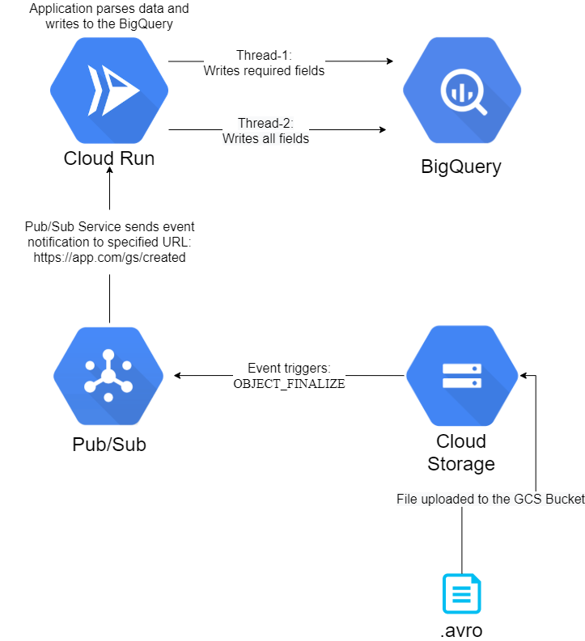

# Data Processing Task for RinfTech
DataProcessing Application implements background service, receives notifications from Cloud Storage (using PubSub Service), which triggers when new files added to specified bucket.
If uploaded file is of type .avro, application performs deserialization and concurrently writes deserialized objects fields to 2 different tables in BigQuery.
Avro Schema file: [client.avsc](/src/main/avro/client.avsc)

DataFlow Diagram:

